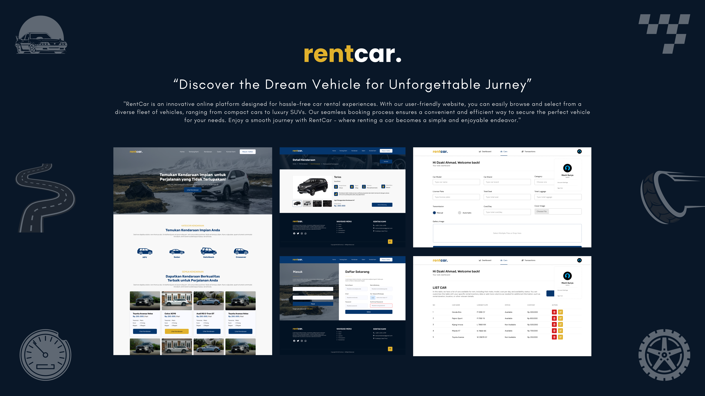

# :car: rentcar. _“Style with Ease, Confidence with Fashionism”_ Jaster Media 2023 Team Project ~

Lorem ipsum dolor sit amet, consectetur adipiscing elit. Sed do eiusmod tempor incididunt ut labore et dolore magna aliqua. Ut enim ad minim veniam, quis nostrud exercitation ullamco laboris nisi ut aliquip ex ea commodo consequat. Duis aute irure dolor in reprehenderit in voluptate velit esse cillum dolore eu fugiat nulla pariatur. Excepteur sint occaecat cupidatat non proident, sunt in culpa qui officia deserunt mollit anim id est laborum.

## Team Members :busts_in_silhouette:

| No  | Name                                                   | University                   | Position                       |
| --- | ------------------------------------------------------ | ---------------------------- | ------------------------------ |
| 1   | [Moch Surya Diva Nurkhoir](https://github.com/msuryaa) | Politeknik Negeri Banyuwangi | UI Designer :art:              |
| 2   | [Dzaki Ahmad Fajrianto](https://github.com/dzakiaf19)  | Politeknik Negeri Banyuwangi | Back-End Developer :computer:  |
| 3   | [Ayu Wulandari](https://github.com/AyuWulandari16)     | Politeknik Negeri Banyuwangi | Front-End Developer :computer: |
| 4   | [Gabriel Radith Widianto](https://github.com/GRadith)  | SMK Telkom Sidoarjo          | Front-End Developer :computer: |

## Tech Stack :technologist:

| Learning Path      |                                                                                                                                                                                                                                                                                                                                                                                                                                                                                                                                                                                                                                                           |
| ------------------ | :-------------------------------------------------------------------------------------------------------------------------------------------------------------------------------------------------------------------------------------------------------------------------------------------------------------------------------------------------------------------------------------------------------------------------------------------------------------------------------------------------------------------------------------------------------------------------------------------------------------------------------------------------------: |
| Machine Learning   |       |
| Cloud Computing    |                                                                                                |
| Mobile Development |                                                                                                                                                                                                                                                                                                                      |

## ML Architecture :brain:

## Cloud Architecture :cloud_with_lightning_and_rain:

## Mobile Architecture :iphone:

